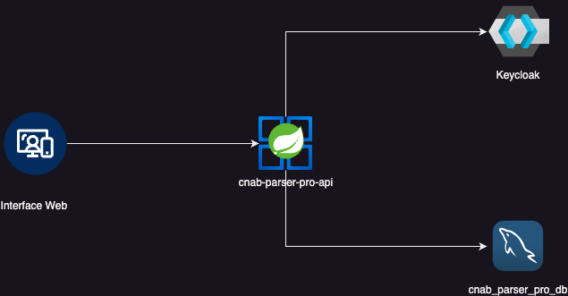

# CNAB Parser Pro
[](https://www.postgresql.org/)
[](https://www.java.com/)
[](https://spring.io/projects/spring-boot/)
[](https://www.openapis.org/)
[](https://swagger.io/)
[](https://www.docker.com/)
[](https://www.keycloak.org/)
---

[](https://sonarcloud.io/summary/new_code?id=souluanf_cnab-parser-pro)
[](https://sonarcloud.io/summary/new_code?id=souluanf_cnab-parser-pro)
[](https://sonarcloud.io/summary/new_code?id=souluanf_cnab-parser-pro)
[](https://sonarcloud.io/summary/new_code?id=souluanf_cnab-parser-pro)
[](https://sonarcloud.io/summary/new_code?id=souluanf_cnab-parser-pro)
[](https://sonarcloud.io/summary/new_code?id=souluanf_cnab-parser-pro)
[](https://sonarcloud.io/summary/new_code?id=souluanf_cnab-parser-pro)
[](https://sonarcloud.io/summary/new_code?id=souluanf_cnab-parser-pro)
[](https://sonarcloud.io/summary/new_code?id=souluanf_cnab-parser-pro)
[](https://sonarcloud.io/summary/new_code?id=souluanf_cnab-parser-pro)
[](https://sonarcloud.io/summary/new_code?id=souluanf_cnab-parser-pro)
---
**CNAB Parser Pro** é um sistema robusto para o **processamento de transações financeiras** a partir de arquivos no
formato **CNAB**. O sistema permite importar, normalizar e armazenar as informações das movimentações financeiras,
fornecendo um **dashboard interativo** para análise dos dados.

> 🔹 **Objetivo:** Automatizar a importação e visualização de transações, garantindo uma gestão eficiente dos dados
> financeiros de múltiplas lojas.
---

## Sumário

1. [Funcionalidades](#funcionalidades)
2. [Tecnologias Utilizadas](#tecnologias-utilizadas)
2. [Requisitos](#requisitos)
3. [Execução](#execução)
   - [Requisitos](#requisitos)
   - [Clonar o Repositório](#clonar-o-repositório)
   - [Configurar Variáveis de Ambiente](#configurar-variáveis-de-ambiente)
   - [Subir os Containers](#subir-os-containers)
   - [Acessar a API Documentada (Swagger)](#acessar-a-api-documentada-swagger)
4. [Credenciais Padrao](#credenciais-padrão)
5. [Testes Automatizados](#testes-automatizados)
5. [Query](#query)


## Funcionalidades

###  Frontend
- Upload de arquivos CNAB para processamento.
- Visualização das transações processadas.
- Listagem de transações agrupadas por loja.
- Exibição de saldo total por loja.
- Tela de login integrada ao **Keycloak**.

### Backend
#### Autenticação e Segurança
- **Obtenção de token JWT** (`/v1/auth/token`).
- **Atualização de token JWT** (`/v1/auth/refresh-token`).
- **Logout do usuário** (`/v1/auth/logout`).

#### Processamento de Arquivos
- **Upload e processamento de arquivos CNAB** (`/v1/transactions/process-file`).

#### Transações
- **Listar todas as transações** (`/v1/transactions`).
- **Buscar transações por loja** (`/v1/transactions/store/{name}`).
- **Consultar saldo total por loja** (`/v1/transactions/store/balance`).
- **Obter transações agrupadas por loja** (`/v1/transactions/grouped`).
- **Buscar transações por CPF** (`/v1/transactions/cpf/{cpf}`).

---

## Arquitetura do Sistema

A arquitetura do **CNAB Parser Pro** segue um modelo baseado em microsserviços e autenticação centralizada. O fluxo principal inclui:

- **Frontend (HTML, CSS, JS)** para interação com o usuário.
- **Backend (Spring Boot, Java 21)** responsável pelo processamento das transações e API REST.
- **Banco de Dados (PostgreSQL)** para persistência das informações.
- **Keycloak** para autenticação e gerenciamento de usuários.
- **Docker e Docker Compose** para facilitar a orquestração dos serviços.


---

## Execução

### Requisitos

- Docker e Docker Compose instalados. [Instalação](https://docs.docker.com/get-docker/)

###  Clonar o Repositório**

```bash
git clone https://github.com/souluanf/cnab-parser-pro.git
cd cnab-parser-pro
```

### Configurar Variáveis de Ambiente**

Copie o arquivo de exemplo `.env.example` e configure suas credenciais:

```bash
cp .env.example .env
```

### Subir os Containers

```bash
docker compose up -d
```

Os serviços disponíveis são:

- **Backend:** [http://localhost:8080/api](http://localhost:8080/api)
- **Frontend:** [http://localhost:3000](http://localhost:3000)
- **Keycloak:** [http://localhost:8085](http://localhost:8085)

### Acessar a API Documentada (Swagger)

A API está disponível na rota:  [http://localhost:8080/api](http://localhost:8080/api)

Ou via **Postman**:

[](https://app.getpostman.com/run-collection/26187327-049eb586-d362-4a88-957f-fd93d21b6b59)

---

## Credenciais Padrão

| Serviço                   | URL              | Usuário              | Senha                |
|---------------------------|------------------|----------------------|----------------------|
| **Banco de Dados**        | `localhost:5432` | `cnab_parser_pro_db` | `cnab_parser_pro_db` |
| **Keycloak**              | `localhost:8085` | `admin`              | `admin`              |
| **Aplicação (Front-end)** | `localhost:3000` | `admin`              | `admin`              |
| **API**                   | `localhost:8080` | `admin`              | `admin`              |

---

## Testes Automatizados

Este projeto possui **testes unitários e de integração** garantindo a qualidade do código. Para executá-los, rode:

```bash
mvn test
```

Os testes cobrem:

✅ **Validação e importação de arquivos CNAB**  
✅ **Persistência de dados no PostgreSQL**  
✅ **Autenticação e geração de tokens JWT**  
✅ **Endpoints da API (Controller e Service)**

---

## Query

Consulta para transações agrupadas por loja.

```sql
SELECT t.store_name  AS nome,
       t.store_owner AS dono,
       SUM(t.value)  AS saldo_total,
       json_agg(
               json_build_object(
                       'id', t.id,
                       'type', json_build_object(
                               'id', CASE t.type
                                         WHEN 'DEBIT' THEN 1
                                         WHEN 'BANK_SLIP' THEN 2
                                         WHEN 'FINANCING' THEN 3
                                         WHEN 'CREDIT' THEN 4
                                         WHEN 'LOAN_RECEIPT' THEN 5
                                         WHEN 'SALES' THEN 6
                                         WHEN 'TED_RECEIPT' THEN 7
                                         WHEN 'DOC_RECEIPT' THEN 8
                                         WHEN 'RENT' THEN 9
                           END,
                               'description', CASE t.type
                                                  WHEN 'DEBIT' THEN 'Débito'
                                                  WHEN 'BANK_SLIP' THEN 'Boleto'
                                                  WHEN 'FINANCING' THEN 'Financiamento'
                                                  WHEN 'CREDIT' THEN 'Crédito'
                                                  WHEN 'LOAN_RECEIPT' THEN 'Recebimento Empréstimo'
                                                  WHEN 'SALES' THEN 'Vendas'
                                                  WHEN 'TED_RECEIPT' THEN 'Recebimento TED'
                                                  WHEN 'DOC_RECEIPT' THEN 'Recebimento DOC'
                                                  WHEN 'RENT' THEN 'Aluguel'
                                                  ELSE 'Desconhecido'
                                   END,
                               'nature', CASE t.type
                                             WHEN 'DEBIT' THEN 'Entrada'
                                             WHEN 'CREDIT' THEN 'Entrada'
                                             WHEN 'LOAN_RECEIPT' THEN 'Entrada'
                                             WHEN 'SALES' THEN 'Entrada'
                                             WHEN 'TED_RECEIPT' THEN 'Entrada'
                                             WHEN 'DOC_RECEIPT' THEN 'Entrada'
                                             ELSE 'Saída'
                                   END,
                               'signal', CASE t.type
                                             WHEN 'DEBIT' THEN '+'
                                             WHEN 'CREDIT' THEN '+'
                                             WHEN 'LOAN_RECEIPT' THEN '+'
                                             WHEN 'SALES' THEN '+'
                                             WHEN 'TED_RECEIPT' THEN '+'
                                             WHEN 'DOC_RECEIPT' THEN '+'
                                             ELSE '-'
                                   END
                               ),
                       'date', t.date,
                       'value', t.value,
                       'cpf', t.cpf,
                       'card', t.card,
                       'hour', t.hour
               )
       )             AS transacoes
FROM transactions t
GROUP BY t.store_name, t.store_owner;
```
---
## Contato

Se tiver dúvidas ou sugestões, entre em contato:

📧 **Email:**  [contact@luanfernandes.dev](mailto:contact@luanfernandes.dev)  
🌐 **Linkedin:** [souluanf](https://linkedin.com/in/souluanf)


